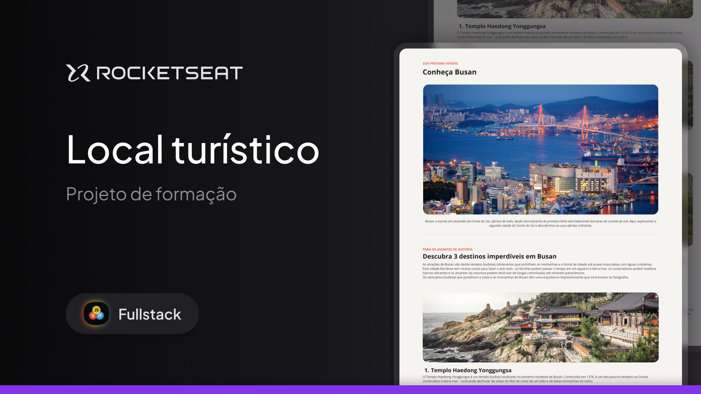

Desafio de projeto de um local turistico proposto durante as aulas sobre Fundamentos do HTML e CSS na Rocketseat.

  <a href="#-tecnologias">Tecnologias</a>&nbsp;&nbsp;&nbsp;|&nbsp;&nbsp;&nbsp;
  <a href="#-projeto">Projeto</a>&nbsp;&nbsp;&nbsp;|&nbsp;&nbsp;&nbsp;
  <a href="#memo-licença">Licença</a>&nbsp;&nbsp;&nbsp;|&nbsp;&nbsp;&nbsp;

  

 

  

## 🚀 Tecnologias
Esse projeto foi desenvolvido com as seguintes tecnologias:

- HTML
- CSS

## Projeto
Nesse desafio de projeto iremos desenvolver uma página de um local turistico.